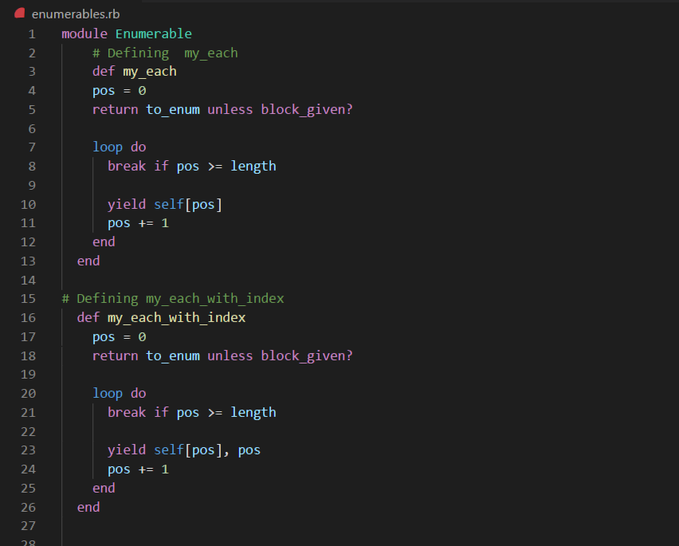

# Building-Blocks---Enumerables

Enumerables

Code on Ruby

## Getting the Repo

git clone https://github.com/shubham14p3/Building-Blocks---Enumerables.git

## Built With

- RUBY

## Live Demo

[Live Demo Link](https://github.com/shubham14p3/Building-Blocks---Enumerables.git/.)

## Authors

👤 Shubham Raj

- Github: [@ShubhamRaj](https://github.com/shubham14p3)
- Linkedin: [Shubham14p3](https://www.linkedin.com/in/shubham14p3/)

## 🤝 Contributing

Contributions, issues and feature requests are welcome!

Feel free to check the [issues page](https://github.com/shubham14p3/Building-Blocks---Enumerables.git/issues/).

## Show your support

Give a ⭐️ if you like this project!

